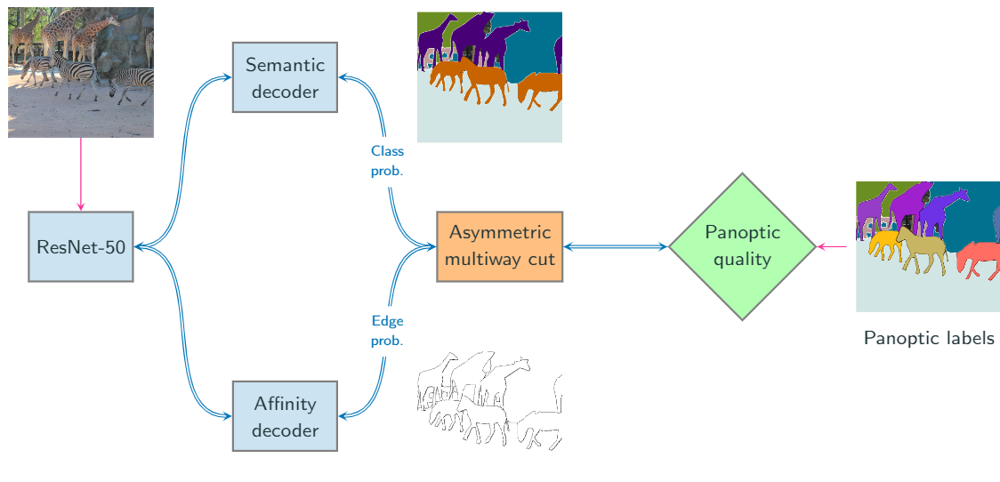

# Combinatorial Optimization for Panoptic Segmentation (COPS)
Official code for NeurIPS'21 paper "[Combinatorial Optimization for Panoptic Segmentation: A Fully Differentiable Approach](https://arxiv.org/abs/2106.03188)". 

**TLDR:** _Panoptic segmentation pipeline containing CNN and a combinatorial optimization problem (AMWC). The whole pipeline is trained with panoptic quality loss by backpropagating through AMWC._
# Installation
Our codebase is built upon the [detectron2](https://github.com/facebookresearch/detectron2) framework with some of our (minor) modifications 
such as printing per-image panoptic quality. For more information please consult the documentation of detectron2 as the codebase is designed according to their guidelines.
The code is developed and tested on `CUDA 10.1`. We use conda package manager to manage the dependencies. The steps to set-up the environment are as follows:

    conda create -n cops python=3.7
    conda activate cops

Which creates and activates the environment. Afterwards check the contents of `install.sh` to install the dependencies (Make sure to fetch all submodules recursively). 

# Setting up the datasets
Please follow the guidelines of detectron2 from [detectron2_datasets](https://detectron2.readthedocs.io/en/latest/tutorials/builtin_datasets.html) to set-up the datasets. 

# Organization
1. Please see `affinityNet/panoptic_affinity/config.py` to see all configurations parameters related to backbone, decoders, dataset etc. Instantiation of these parameters is done in config files present in `affinityNet/configs` folder. 
2. Whole pipeline is defined in `affinityNet/panoptic_affinity/panoptic_seg_affinity.py`.
3. Panoptic quality surrogate loss, gradients of AMWC, instance segmentation confidence scores are computed from `affinityNet/panoptic_affinity/losses.py`.
4. In case of confusion w.r.t overall code structure, data generation etc. consulting detectron2 should help.

# Training
## Cityscapes
### Pretraining:

    python train_net.py --config-file configs/Cityscapes-PanopticSegmentation/panoptic_affinity_pretrain.yaml --num-gpus 1 --resume

### Fully differentiable training:
Assuming that the output of pretraining phase is saved to `PRETRAINED_DIR`
where `WEIGHTS` is the name of checkpoint file. Then run the following command by replacing the values of above-mentioned variables:

    python train_net.py --config-file configs/Cityscapes-PanopticSegmentation/panoptic_affinity_end_to_end.yaml --base-config-file ${PRETRAINED_DIR}/config.yaml --num-gpus 1 --resume MODEL.WEIGHTS ${PRETRAINED_DIR}/${WEIGHTS}

## COCO
### Pretraining:
We use `4` GPUs. Please change appropriately according to your setup:

    python train_net.py --config-file configs/COCO-PanopticSegmentation/panoptic_affinity_pretrain.yaml --num-gpus 4 --resume
    
### Fully differentiable:

    python train_net.py --config-file configs/COCO-PanopticSegmentation/panoptic_affinity_end_to_end.yaml --base-config-file ${PRETRAINED_DIR}/config.yaml --num-gpus 1 --resume MODEL.WEIGHTS ${PRETRAINED_DIR}/${WEIGHTS}

# Evaluation
Assuming `MODEL_DIR` corresponds to the folder containing the checkpoint with name `WEIGHTS`. Folder by name `OUT_FOLDER` will be created which will contain the evaluation results. Setting `MODEL.SAVE_RESULT_IMAGES` to `True` will additionally save result images (can be slow). 

    python train_net.py --config-file ${MODEL_DIR}/config.yaml --num-gpus 1 --eval-only MODEL.WEIGHTS ${MODEL_DIR}/${WEIGHTS} OUTPUT_DIR ${MODEL_DIR}/${OUT_FOLDER} DATALOADER.EVAL_BATCH_SIZE 1 DATALOADER.NUM_WORKERS 0 MODEL.SAVE_RESULT_IMAGES False

Where `DATALOADER.EVAL_BATCH_SIZE` controls batch size during inference. Set to larger than `1` to evaluate faster.

# Pretrained models

Pretrained models after full training and their results: 

|Dataset| Backbone | PQ | PQ_st | PQ_th | Per image inference time (s) | Checkpoint file |
|--|--|--|--|--|--|--|
|Cityscapes  | ResNet50 |  62.1 | 67.2 | 55.1 | 1.8 | [one_drive_link](https://1drv.ms/u/s!AoOFNp40l0lAgqMLbxdOwTayOT107w?e=3XKtx6) |
|COCO | ResNet50 | 38.4 | 35.2 | 40.5 | 0.4 | [one_drive_link](https://1drv.ms/u/s!AoOFNp40l0lAgqMKarjx9xbAIct1wg?e=lZzWxh) |
